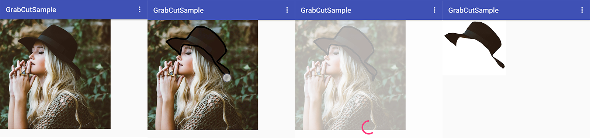

# GrabCutAndroid

A dummy app that demonstrates foreground-background segmentation using the GrabCut algorithm in Android using OpenCV and Kotlin.

This fork uses a polygon outline as a mask instead of only a rectangle, for increased accuracy and speed.

## Results

Input image; draw outline; processing; result:

The above took roughly 3 seconds on a 1080x1080px input image on a Nexus 6P.

## To do:

- [ ] Use findContours to pick the largest contour in the mask
- [ ] Perform poor man's anti-aliasing by rendering the contour on a 4x upscaled mask and resize down the cut image. 

## Project dependencies:
- Kotlin 1.51.1
- OpenCV 3.3.1
- RxJava 2.1.6
- RxKotlin 2.1.0
- RxAndroid 2.0.1
- RxPermissions 0.9.4
